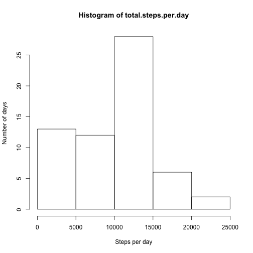
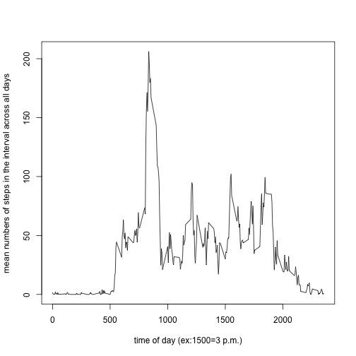
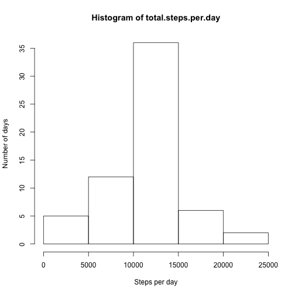
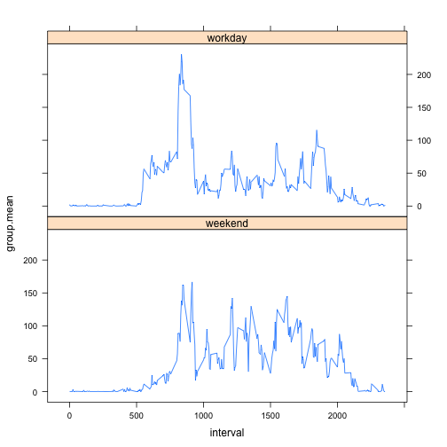

# Peer Assessment 1 in "Reproducible Research"


```r
opts_chunk$set(echo=TRUE)
```

We install and load the necessary packages


```r
ipak<-function(pkg){
  new.pkg<- pkg[!(pkg %in% installed.packages()[,"Package"])]
  if(length(new.pkg))
    install.packages(new.pkg,dependencies=TRUE)
  sapply(pkg,require,character.only=TRUE)
}
packages<-c("dplyr","lattice","knitr")
ipak(packages)
```

```
## Loading required package: dplyr
## 
## Attaching package: 'dplyr'
## 
## The following objects are masked from 'package:stats':
## 
##     filter, lag
## 
## The following objects are masked from 'package:base':
## 
##     intersect, setdiff, setequal, union
## 
## Loading required package: lattice
```

```
##   dplyr lattice   knitr 
##    TRUE    TRUE    TRUE
```

We download and unzip the file

```r
fileUrl<-"https://d396qusza40orc.cloudfront.net/repdata%2Fdata%2Factivity.zip"
download.file(fileUrl,destfile="datoscomprimidos.zip")
unzip("datoscomprimidos.zip",unzip="internal")
```

We read the raw data

```r
raw<-read.csv("activity.csv",header=T)
```


We calculate the total steps per day. We have to sum all the steps, grouping by day.

```r
total.steps.per.day<- tapply(raw$steps,raw$date,sum,na.rm=T)
```

Make a histogram of the total number of steps taken each day

```r
hist(total.steps.per.day,ylab="Number of days",xlab="Steps per day")
```

 

We calculate and report the mean and median of the total number of steps taken each day

```r
mean(total.steps.per.day,na.rm=T)
```

```
## [1] 9354.23
```

```r
median(total.steps.per.day,na.rm=T)
```

```
## [1] 10395
```

A time series plot of the 5 minute interval and the average number of steps taken, averaged across all days.

```r
x <-unique(raw$interval)
y <-tapply(raw$steps,raw$interval,mean,na.rm=T)
plot(x,y,type="l",xlab="time of day (ex:1500=3 p.m.)", ylab="mean numbers of steps in the interval across all days")
```

 

Which 5-minute interval, on average across all the days in the dataset, contains the maximum number of steps?

```r
names(which(y==max(y)))
```

```
## [1] "835"
```

The total number of missing values in the dataset is 2304

We fill the missing values with the mean for that interval of the day

```r
filled<-raw %>% 
      group_by(interval) %>%
      mutate(steps=replace(steps,is.na(steps),mean(steps,na.rm=T)))
```

To calculate the total steps per day, we have to sum all the steps, grouping by day.

```r
total.steps.per.day<- tapply(filled$steps,filled$date,sum,na.rm=T)
```

Histogram of the total number of steps taken each day

```r
hist(total.steps.per.day,ylab="Number of days",xlab="Steps per day")
```

 

Calculate and report the mean and median of the total number of steps taken each day

```r
mean(total.steps.per.day,na.rm=T)
```

```
## [1] 10766.19
```

```r
median(total.steps.per.day,na.rm=T)
```

```
## [1] 10766.19
```

These values differ from the first part of the assignment. Imputing missing data before estimating the total daily number of steps results in higher estimates.

We create a new factor variable in the dataset with the filled-in missing values, that indicates if the day is a workday or a weekend day.

```r
filled2<-filled %>%
          mutate(date=as.Date(date),diasem=weekdays(date),weekday=strftime(date,"%u")) %>%
          mutate(day.type=ifelse(weekday %in% c("6","7"),"weekend","workday")) %>% #I use numbers to avoid problems with the locale and languages
          mutate(day.type=as.factor(day.type))
```

Then we make a panel plot with the lattice system

```r
df3<-filled2 %>% 
  group_by(day.type,interval) %>%
  summarise(group.mean=mean(steps))

xyplot(group.mean~interval|day.type,data=df3,type="l",layout=c(1,2))
```

 


